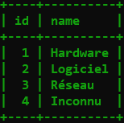
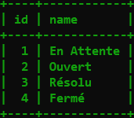
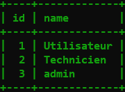
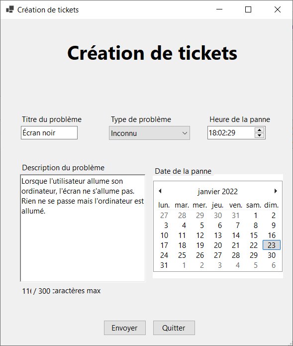
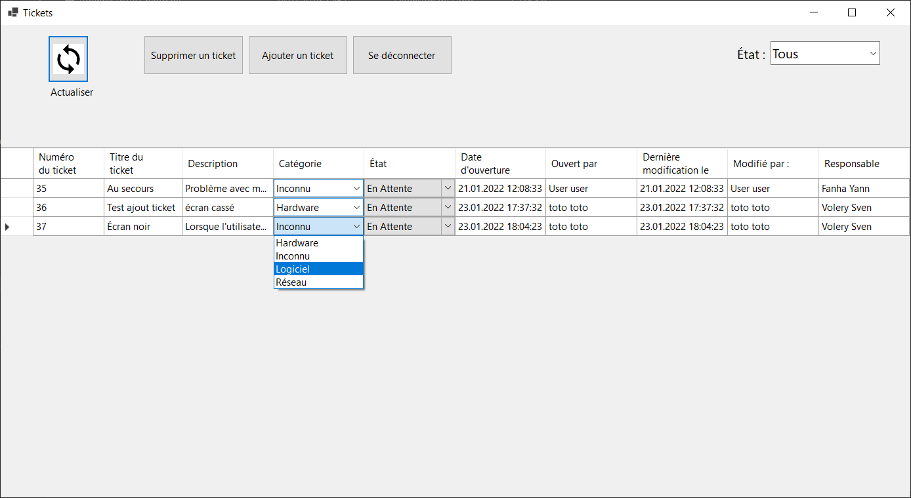
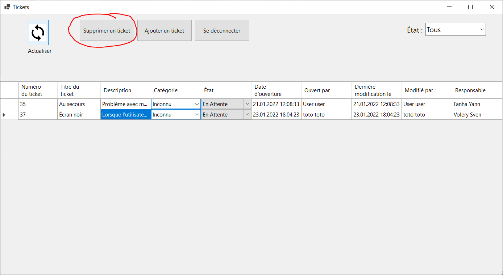
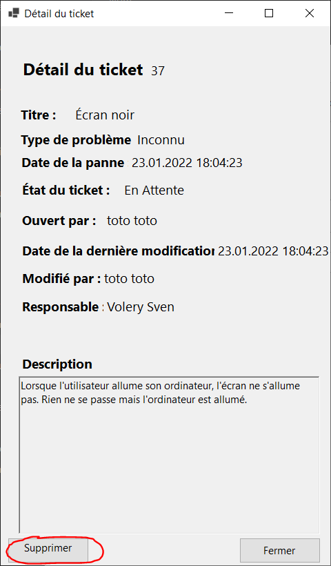
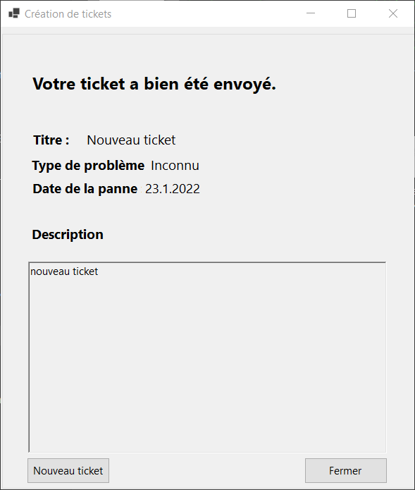

# Ticketing - Documentation
Application Windows Form en C#. Projet dans le cadre du modules "Projet C#" de 3ème année, 2ème trimestre
>Version : **1.0** \
>GitHub : **https://github.com/YFanha/ProjCsharp** 

***
# Table des matières
>1. [Description de l'application](#description)
>2. [Organisation](#organisation)
>    1. [Développeurs](#developpeur) 
>    2. [Gestion de projet](#gestiondeprojet) 
>    3. [Planification](#planification)
>3. [Conception](#conception) 
>    1. [Matériel et logiciel](#matos) 
>    2. [Technologies utilisées](#technologies)
>    3. [Base de données](#database)
>    4. [Stratégie de test](#tests)
>4. [Fonctionnalités manquantes](#manquantes)
>5. [Amélioration possible](#amelioration)
>6. [Guide d'installation](#installations)
>7. [Guide d'utilisations](#utilisations)
***

# 1 - Description de l'application <a name="description"></a>
Application Windows de ticketing. Cette application permet à des utilisateurs authentifiés d'ajouter des tickets pour que leur problème soit résolu au plus vite. Les techniciens peuvent eux, voir tous les tickets, les modifiers (Description, état, catégorie).

# 2 - Organistation <a name="organisation"></a>
## 2.1 - Développeurs <a name="developpeur"></a>
> - **Yann Fanha** - Yann.FANHA-DIAS@cpnv.ch
>   - *Développeur back-end, modélisation et gestion de la base de données*
> - **Simon Cuany** - Simon.CUANY@cpnv.ch
>   - *Développeur front-end*
> - **Sven Volery** - Sven.VOLERY@cpnv.ch
>   - *Développeur front-end*

## 2.2 - Gestion de projet  <a name="gestiondeprojet"></a>
Nous avons utilisé l'application ``Notion`` pour la gestion de projet et nos journaux de travail. Nous l'avons également utilisé pour rédiger le cahier des charges. La gestion de projet était légére, le but étant de nous concentrer sur la réalisation du projet. Pour gérer les fichiers et leurs version, nous avons utilisé `GitHub`.
> - Lien du notion : https://fanha.notion.site/Projet-C-Application-de-gestion-de-ticket-b0f3245a593e42f79fc77246d4b942e1
> - Lien du répertoire GitHub : https://github.com/YFanha/ProjCsharp

## 2.3 - Planification  <a name="planification"></a>
### **Sprint 1** 
```
Rédaction Cahier des charges, Création des vues, modélisation de la base de données, création du BL de base (classe de User, tickets), de la connexion à la base de données. et du login

Date de début  : Mardi 16 Novembre 2021
Date de fin : Jeudi 16 Décembre 2021
```
### **Sprint 2**
```
Implémentation du BL dans les vues, création de l'ajout, de la modification et de la suppression des tickets.

Date de début  : Vendredi 17 Décembre 2021
Date de fin : Jeudi 20 Janvier 2022
```
#### **Sprint 3**
```
Rédaction du dossier de projet avec manuel d'installation/utilisation et préparation de la présentation

Date de début  : Vendredi 21 Janvier 2021
Date de fin : Lundi 24 Janvier 2022
```

# 3 - Conception <a name="conception"></a>
## 3.1 - Matériel et logiciel utilisé <a name="matos"></a>
### **Matériel :**
> - Poste du CPNV, tournant sur Windows 10 Éducation
> - Ordinateur personnel de chacun
### **Logiciel :**
> - **Visual Studio Code** - Pour le développement, la compilation et le débogage
> - **Notion** - Pour la gestion de projet (sprint, tâche, journaux de travail)
> - **GitHub** - Pour la gestion des versions des fichiers
> - **MySQL Workbench** - Pour la modèlisation de la base de données et la création du script depuis le MLD
> - **MySQL 5.5.62** - En tant que système de gestion de base de données
> - **VMware Workstation** - Pour la création d'une machine virtuelle tournant sur Debian 10 pour hébérger MySQL
> - **HeidiSQL** - Pour l'administration de la base de données (vue des données, ajout/suppression de données)

## 3.2 - Technologies utilisées <a name="technologies"></a>
C'est une application Windows Form écrite en ``C#`` avec ``.NET 5.0`` comme framework. Pour se connecter et intéragir avec la base de données, l'application utilise le package ``MySQL.Data``.

## 3.3 - Base de données <a name="database"></a>
Les données seront stockées sur une base de données MySQL. Le modèle logique des données est le suivant

Les données des tables `roles`, `states`, et `categories` seront des données de base. Elles sont nécessaires ont bon fonctionnement de l'application. Ces données seront directement enregistrées lors de l'éxecution du script : `Conception/MLD/scripts/mainScript.sql`. \
*Ce script crée les tables, insère les données de base et crée également un utilisateur pour se connecter à la base de données avec l'application.*

### **Données de base**
#### **categories**


#### **states**


#### **roles**


## 3.4 - Stratégie de test <a name="tests"></a>
Les tests ont été effectués au fur et à mesure du développement de l'application. Lorsqu'une nouvelle fonction était implémentée, nous la testion, avec différents scénario et sur nos 3 postes pour voir si une erreur apparaissait. \
Nous avons également testé, avec la version prête à être rendue, d'installer la base de données `ticketing` sur nos ordinateurs personnels avec le script ``ticketing.sql`` afin de vérifié que tout l'installation fonctionnait bien.

# 4 - Fonctionnalités manquantes <a name="manquantes"></a>
> - Les administrateurs ne peuvent pas créer de compte. La fonction a déjà été créée mais elle n'a pas été implémentée et donc pas testée. Il manque le formulaire à créer pour pouvoir le faire. La seule façon de se créer un compte (utilisateurs ou technicien) est donc de passer par des requêtes SQL manuelle, avec heidiSQL par exemple.
> - Informations de fermeture de ticket (personne l'ayant fermé et date de la fermeture) non affichée.

# 5 - Améliorations possibles <a name="amelioration"></a>
> - Trouver une icone
> - Hacher les mots de passe dans la base de données.
> - Garder le login ouvert quand on ferme l'application
> - Améliorer la vue, le rendre plus moderne
> - Rechercher un ticket par un champ de texte

# 6 - Guide d'installation <a name="installations"></a>
 - Pour pouvoir utiliser l'application, il faudra avoir la base de données en local (127.0.0.1). 
 - Il faudra ensuite exécuter le script ```ticketing.sql``` sur le serveur MySQL pour créer la base de données et insérer certaine données présentes lors de la création du script. Ce script à été effectué automatiquemnt par heidiSQL le 21.01.2022. Le script se trouve sous ```Conception\ticketing.sql```. Le script créera également l'utilisateur suivant pour l'application. C'est les identifiants que l'application va utiliser pour se connecter.
Sans cette base de données, l'application ne pourra pas tourner correctement. \
- Si la base de données n'est pas hébérgée en local, donc pas à l'adresse 127.0.0.1, il faudra modifier le fichier "DatabaseInteractions.cs" pour y changer l'adresse IP du serveur. 
Requête pour créer l'utilisateur : _(le script ticketing.sql le fait automatiquement)_

``` SQL
CREATE USER 'admin'@'%' IDENTIFIED BY 'Pa$$w0rd';
GRANT SELECT, INSERT, UPDATE, DELETE, CREATE, ALTER on *.* TO 'admin'@'%';
```
 **Dossier de l'exécutable** : pour utiliser l'application, le dossier ```Ticketing\bin\Debug\net5.0-windows``` suffit. L'application pour se lancer et fonctionner correctement (à condition d'avoir bien installé la base de de données). L'exécutable se trouve dans ce dossier.

# 7 - Guide d'utilisation <a name="utilisations"></a>
## 7.1 - Se connecter
Pour se connecter, il faut renseigner votre adresse email aindi que votre mot de passe. Votre compte doit être créé avant.

*Des comptes ont été créer afin de tester l'application.*

### **Compte de technicien**
> - Adresse email : a@a.a
> - mot de passe : a
### **Compte d'utilisateur**
> - Adresse email : b@b.b
> - mot de passe : b

## 7.2 - Gérer les tickets (Technicien)
Lorsqu'on se connecte avec un compte de technicien, nous arrivons sur la page des tickets

### **Ajouter un ticket**
Pour ajouter un ticket, il faut cliquer sur "Ajouter un ticket". Le formulaire de création de ticket va s'ouvrir et vous pourrez ensuite renseigner les informations du problème.
 \

Pour ensuite voir le ticket dans l'affichage des tickets, il faut cliquer sur "Rafraichir" afin que les données soient mises à jour.
### **Modifier un ticket**
Pour modifier, un ticket, il suffit de modifier la valeur dans le tableau. Cependant, seulement les champs suivant sont modifiables : 
- Description
- Catégorie
- État

Les champs de date et de personne se modifie automatiquement.


### **Supprimer un ticket**
Il y a deux manières de supprimer un ticket.
- En selectionnant la ligne puis en cliquant sur supprimer sur la page des tickets
- 
- En ouvrant les détails d'un ticket et un cliquant sur supprimer en bas de la fenêtre des détails
- 


## 7.3 - Ajouter un ticket (Utilisateur)
Lorsqu'on se connecter avec un compte de simple utilisateur, on arrive directement sur le formulaire d'ouverture d'un ticket car un simple utilisateur ne peut pas voir les autres tickets. A la place, lorsqu'il enregistre son ticket, il obtient un message de confirmation.

